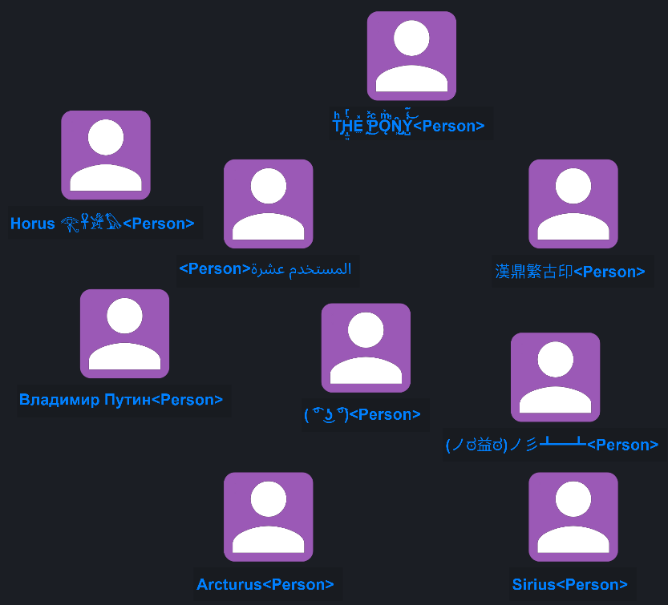

# CONSTELLATION and fonts

CONSTELLATION uses the fonts installed on your workstation to draw node and connection labels on graphs. More than one font can be used, depending on the text being displayed. This document explains how you can choose the fonts use by CONSTELLATION to draw labels. (Some of the Unicode terminology may be a bit imprecise.)

By default, CONSTELLATION uses a Java built-in font called "SansSerif", which typically represents the font "Arial" on Windows 10. When you run CONSTELLATION and add a node to a graph, the label will look like this.


The Arial font is easy to read. If all of your labels consist of Latin alphabetic characters, digits, and punctuation (basically anything in the Latin-1 character set), and you're happy with Arial, you can stop reading now.

You night like a font that looks a little bolder. If you go to Setup &rarr; Options &rarr; CONSTELLATION &rarr; Fonts, you'll see the font configuration page. In the text area on the left, add the text:

```
Arial,BOLD
```

(Whenever you edit the font configuration, you should press the "Check config" button to make sure you haven't made any typos.)

Select OK, save your graph, restart CONSTELLATION, and reload your graph. It should look like this.


If you prefer something with serifs, try "Times New Roman". Go to the font configuration page again, and replace the Arial text with

```
Times New Roman
```

After restarting CONSTELLATION, you should see this.


Let's go back to Arial by opening the font configuration page and replacing "Times New Roman" with "Arial". (You can use "Arial,BOLD" if you like.) Retart CONSTELLATION, open your graph, and add a node with the label "User 5" in Chinese.

```
用户五<User Name>
```
You should see this.


CONSTELLATION has conveniently provided a Chinese font for you. This works because CONSTELLATION and Java are helping out.

* CONSTELLATION always ensures that the SansSerif font is in the list of fonts used, whether you specified it or not.
* Java defines SansSerif not just as Arial, but as a list of fonts. Java will try each font until it finds a font that can display each character.

On my workstation, SanSerif is (partially) defined as the list:

* Arial
* MingLiU
* MingLiU-ExtB

Arial does not contain any Chinese characters, and I don't have the font MingLiU installed, so Java uses MingLiU-ExtB.

This is all very well, but the style of the Chinese font doesn't match the Arial text. I'd prefer to use the Noto Sans CJK SC font, downloadable from [Google's Noto fonts page](https://www.google.com/get/noto/).

Install "Noto Sans CJK SC" on your workstation, then go to the font configuration page in CONSTELLATION and change the text area to this.

```
Arial
NotoSansCJKsc-Regular.otf
```

Note that we're adding the name of the font file, rather than the name of the font. This because Java does not directly recognise OpenType Fonts (.otf files). CONSTELLATION will automatically search your local profile (where you can install your own fonts) and the Windows font directory. You can also specify an absolute filename (such as `C:/Users/User/Downloads/Fonts/NotoSansCJKsc-Regular.otf`) so you can use a font without installing it.

Restart CONSTELLATION and open your graph. You should see this.


The NotoSans Chinese font matches Arial nicely.

Because CONSTELLATION searches fonts from the first entry down, and the default SansSerif font is added to the end of the list, CONSTELLATION finds the Noto Sans font first.

Let's try some Arabic. Arabic script is interesting in CONSTELLATION for two reasons: Arabic script is cursive (joined up writing), and it reads right to left.

Add a node with the label "User ten" in Arabic.

```
المستخدم عشرة
```


The type appears on the left side of the label because right-to-left text reverses the order of the entire label.

Once again, the style of the Arabic font doesn't match the Arial text. Go to [Google's Noto fonts page](https://www.google.com/get/noto/), download Noto Sans Arabic and install it. Change CONSTELLATION's font configuration to this. (We're temporarily using Times New Roman: you'll see why in a moment)

```
Times New Roman
Noto Sans Arabic
NotoSansCJKsc-Regular.otf
```

Restart CONSTELLATION and look at the Arabic text. Unfortunately, Times New Roman includes Arabic characters; because Times New Roman appears first, it's characters are used instead of the Noto Arabic font.


Let's try swapping the order of the fonts.

```
NotoSansCJKsc-Regular.otf
Noto Sans Arabic
Times New Roman
```


Oh dear; we now have Arabic displayed using Noto Sans Arabic, but the Latin text obviously isn't Times New Roman. This is because the Noto Chinese Sans Serif font includes Latin characters, so it is being used before Times New Roman.

No matter which order we put the fonts in, we miss out. What to do?

Unicode has the concept of "scripts". A script is a collection of letters and other written signs used to represent textual information in one or more writing systems. Each Unicode character is associated with a single script. We can tell CONSTELLATION which font to use for a given script.

Set the font configuration to this.

```
Times New Roman,!ARABIC
Noto Sans Arabic
NotoSansCJKsc-Regular.otf
```

The first line says to use Times New Roman if possible, but not for Arabic script characters. Let's try that.


That's just what we want. We could also have said:

```
Times New Roman,LATIN,COMMON
Noto Sans Arabic
NotoSansCJKsc-Regular.otf
```

The first line here says to use Times New Roman, but only for LATIN and COMMON script, where LATIN is the familiar "ABC" script, and COMMON is punctuation, symbols, etc. "LATIN,COMMON" isn't quite the same thing as "!ARABIC" (since "!ARABIC" means all scripts including LATIN and COMMON except ARABIC), but in this case it works the same.

The "Font" and "Script" combo boxes on the font configuration page show all the available fonts, and the scripts that can be used to limit the characters shown by those fonts.

The "Check config" button can be used to ensure that you've entered legal fonts and scripts.

Because CONSTELLATION uses a list of fonts, rather than relying on a single font, you can display all kinds of scripts in labels. The graph below uses Latin, Arabic, Chinese, Cyrillic, Egyptian hieroglyphics, Zalgo text, and of course some good old table flipping.



You can even use fancy fonts such as Ink Free (included with Windows 10).


Or Lobster Two (downloadable from https://fonts.google.com/).


However, you can't use different fonts for the same script: if you have Latin labels, you can't have Times New Roman for a name and Arial for a type, or a Times New Roman label on one node and an Arial label on another node. (Or connection, for that matter.)
